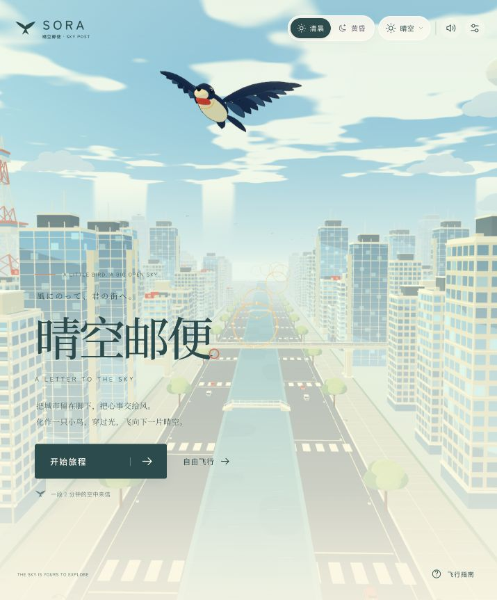
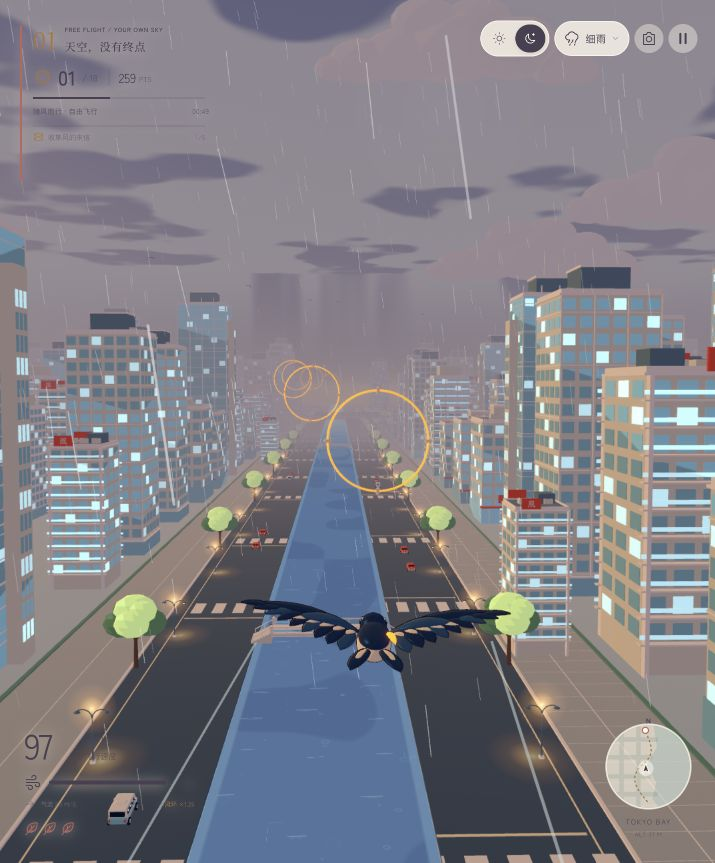

# 晴空邮便 · SORA

[**在线试玩 →**](https://06wj.github.io/sora-flight/) · [兼容模式](https://06wj.github.io/sora-flight/?backend=webgl2) · [部署状态](https://github.com/06wj/sora-flight/actions/workflows/pages.yml)

化作一只小鸟，沿着运河飞过现代都市，在清晨与黄昏之间收集风的来信。

使用 **Hilo3D 2.0.0-alpha.8、TypeScript 和 Vite** 制作的单人 3D 浏览器游戏。日式动画方向的分段明暗、鸟翼描边、柔和远雾、程序化天空、青绿卡通水面与 Bloom，共同构成清透的城市画面。包含飞行旅程、自由飞行、雨雪雷暴、循环投递委托、暂停、结算、重开、摄影模式、画质设置与合成音乐。

## 游戏截图

| 清晨启程 | 黄昏雨中飞行 |
| :---: | :---: |
|  |  |

截图来自游戏实际运行画面。

## 开始运行

需要 Node.js **20.19.0 或更新版本**。

```sh
npm install
npm run dev
```

在浏览器中打开终端显示的地址。正式构建与本地预览：

```sh
npm run build
npm run preview
```

`npm run build` 先执行严格 TypeScript 检查，再生成 `dist/`。部署无需后端服务。

## 玩法

- **开始旅程**：飞完 3000 米航线，通常约 2 分钟；沿途有 30 个风环，目标收集至少 18 个。抵达终点会根据收集情况与剩余状态评级。
- **连续收集**：连续穿环提升积分，靠近圆心穿过获得更多分数；漏环或碰撞会中断连击。
- **御风加速**：消耗体力提高速度，松开后恢复；收集风环也会补充体力。
- **留意楼宇**：旅程中有 3 格飞行状态；碰撞后短暂无敌，耗尽则结束本次旅程。
- **自由飞行**：城市与碰撞体每 3500 米循环，风环持续刷新，没有固定终点，碰撞保留反馈但不会结束飞行。

清晨与黄昏可以随时切换，光线、天空、水面和界面色彩会平滑过渡。摄影模式暂停飞行并隐藏主要界面；进入后按 `C` 可切换至贴近水面的河畔机位，欣赏沿岸建筑与卡通水纹，再用系统截图保存画面。

## 天气与投递委托

通过顶部天气菜单或 `T` 切换天气，天气与清晨 / 黄昏可以自由组合。

| 天气 | 飞行变化 | 穿环与掠楼积分 |
| --- | --- | --- |
| 晴空 | 平稳飞行 | ×1 |
| 雨天 | 雨幕与温和横风 | ×1.25 |
| 飘雪 | 雪花、较慢飞行速度与体力恢复 | ×1.5 |
| 雷暴 | 阵风、闪电与有预警的雷区 | ×2 |

雷区会提前出现在至少 105 米以外，标记位置固定，可以横向或上下闪避；仅在穿过标记平面且身处雷区时造成伤害。自由模式中的雷击不会结束飞行。设置中可减弱闪电闪光。

飞行途中依次完成 **收集 5 个风环 → 加速飞行 300 米 → 3 次完美穿环**，分别奖励 600、800、1000 积分和体力。完美穿环指靠近圆心通过，无需连续完成。委托完成后短暂显示结果，再进入下一项，三项全部完成后循环；暂停时进度停止，重开时重新开始。

## 操作

| 动作 | 键盘 / 鼠标 |
| --- | --- |
| 左右飞行 | `A` / `D` 或 `←` / `→` |
| 爬升 / 下降 | `W` / `S` 或 `↑` / `↓` |
| 加速 | 按住 `Space` 或 `Shift` |
| 清晨 / 黄昏 | `E`，或顶部时间按钮 |
| 切换天气 | `T`，或顶部天气菜单 |
| 暂停 / 继续 | `Esc` |
| 重新启程 | `R` |
| 摄影模式 / 返回 | `F`；摄影时拖动与滚轮调整视角 |
| 河畔机位 / 鸟旁机位 | 摄影模式内按 `C` |
| 拖动飞行 | 在游戏画面上按住并拖动 |

触屏设备可使用方向按钮和加速按钮，也支持在画面上拖动操控、双指加速。手柄使用左摇杆飞行，主按钮或右肩键 / 扳机加速，具体按钮取决于浏览器的手柄映射。暂停、摄影和设置也可通过屏幕按钮操作。

声音需要首次点击开始后启动。时间、天气、声音、画质、减弱闪光设置及最高积分保存于当前浏览器的本地存储，不需要账号。

## 美术与工程

17 个 GLB 模型合计 **3,697,416 字节，约 3.70 MB**。鸟、五类楼宇、树、云、塔、道路、风环、车辆、桥梁、列车、高架轨道与路灯均通过连接的 **Blender MCP** 在新场景中制作，模型源文件随项目提供。

界面字体 Noto Serif SC 与 Zen Kaku Gothic New 以约 160 KB 的 WOFF2 子集随项目本地提供，运行时不请求字体服务。两者采用 SIL Open Font License 1.1，原始许可文件保存在 `public/fonts/`；分发时请保留。

| 路径 | 内容 |
| --- | --- |
| `art/sora-assets.blend` | Blender 美术源文件 |
| `art/asset-manifest.json` | 模型尺寸、节点、材质与制作记录 |
| `art/*-review.png` | 美术检查图 |
| `public/assets/` | 游戏加载的 GLB 模型 |
| `public/fonts/` | 本地字体子集、来源说明与 OFL 许可 |
| `src/game.ts` | 与渲染解耦的飞行、积分和碰撞规则 |
| `src/input.ts` | 键盘、触摸、鼠标与手柄输入 |
| `src/terrain.ts` | 与道路模型长度一致的固定网格铺设 |
| `src/hilo/` | Hilo3D 场景、动画、特效与自定义材质 |
| `src/hilo/water-material.ts` | 卡通分色、水纹、岸边泡沫与雨天涟漪 |
| `src/ui.ts`、`src/style.css` | 菜单、HUD、设置与响应式布局 |
| `src/sound.ts` | 原创合成旋律、风声与事件音效 |
| `tests/game.test.mjs`、`tests/terrain.test.mjs` | 模拟规则与实际道路 GLB 的回归测试 |

模拟以固定步长运行；场景复用模型、材质与有界粒子池。精致、均衡、流畅三档画质调整渲染分辨率，流畅档同时减少可见环境细节。

道路按模型实际的 160 米长度铺设在固定世界网格上，相邻块只在边界相接；道路网格为中央运河留出真实缺口，避免重复路面和水面争抢深度造成闪烁。

五种楼宇已清理重叠底盖，入口玻璃和立柱与墙面分离；岸外地面承接建筑底部，临街建筑留出退距，远景建筑与塔楼避让相邻体块，减少建筑脚部的穿插与闪烁。

河水采用青绿色块分层，搭配稀疏的奶白与浅青短浪线、岸边泡沫和雨天涟漪。水面直接使用卡通材质绘制，不使用反射纹理或额外反射渲染。

雨滴每次出现都会重新随机落点，部分落点会跳过；涟漪的大小、周期和透明度各不相同，跨越相邻区域仍保持完整，远处细节平滑淡出。

## GitHub Pages 自动部署

仓库使用 [GitHub Actions 工作流](.github/workflows/pages.yml) 自动发布至 **https://06wj.github.io/sora-flight/**。

推送到 `main` 后，工作流依次使用 Node.js 24 执行 `npm ci`、`npm test`、`npm run build`，然后将 `dist/` 发布至 GitHub Pages。也可以在 Actions 页面手动运行 **Deploy GitHub Pages**。

如果 Fork 到其他账号，在仓库 **Settings → Pages → Source** 中选择 **GitHub Actions**，启用工作流后推送一次提交或手动运行。资源使用相对路径，可适配不同仓库名称；修改 README 中的试玩链接即可。

## 部署到其他静态站点

1. 运行 `npm ci` 与 `npm run build`。
2. 将 **`dist/` 内的全部文件**上传至静态站点目录，保留生成文件的相对路径。
3. 为站点启用 **HTTPS**。WebGPU 需要浏览器支持和安全上下文；本机 `localhost` 可用于开发。
4. 入口设为 `index.html`。当前 Vite 配置使用相对资源路径 `base: './'`，可放在站点根目录或带末尾斜杠的子目录中。
5. 确保服务器正确提供 JavaScript、`.wasm` 和 `.glb` 文件，不要把资源请求重写成 HTML。WASM 类型应为 `application/wasm`，GLB 可为 `model/gltf-binary`。

无需应用服务器、数据库或运行时 API 密钥。可为带哈希的构建文件设置长期缓存；`index.html` 和保留原名的 GLB 应在更新时重新验证或刷新缓存。

默认 `backend: 'auto'`，根据能力选择 WebGPU 或 WebGL2。排查特定后端时可显式访问：

```text
/?backend=webgl2
/?backend=webgpu
```

引擎固定在 Hilo3D 的 alpha 版本。升级依赖后需重新检查着色器与两个渲染后端；WebGPU 初始化或着色器失败会显示错误，不会在失败后静默改用另一后端。

## 验证

```sh
npm test
npm run typecheck
npm run build
```

生产构建与 **20 项测试已通过**，其中 17 项验证游戏规则，3 项读取实际道路 GLB 并验证运河缺口、平铺接缝与世界网格稳定性。城市、卡通水面和天气已在显式 WebGPU 与 WebGL2 下检查，两后端控制台均无错误。触摸和手柄仍需目标硬件实测。详细范围见 [docs/QA.md](docs/QA.md)。
